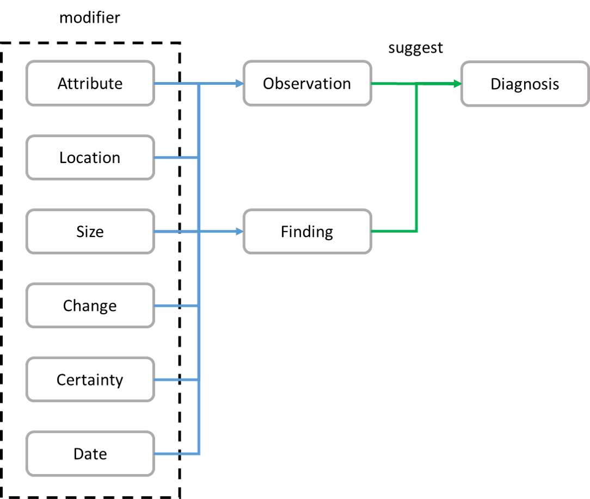
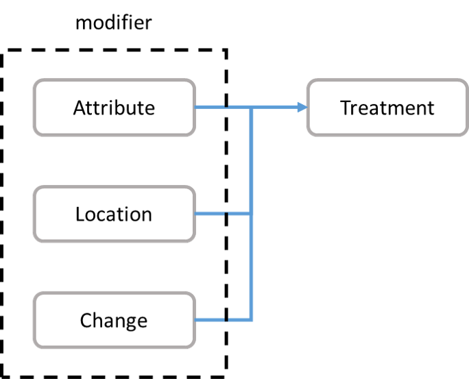
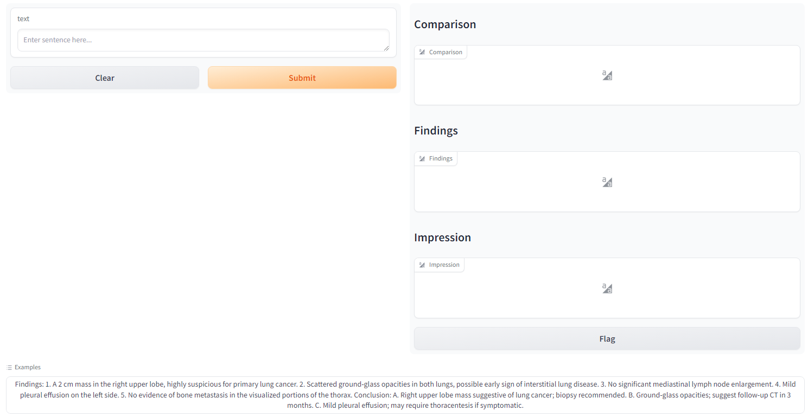
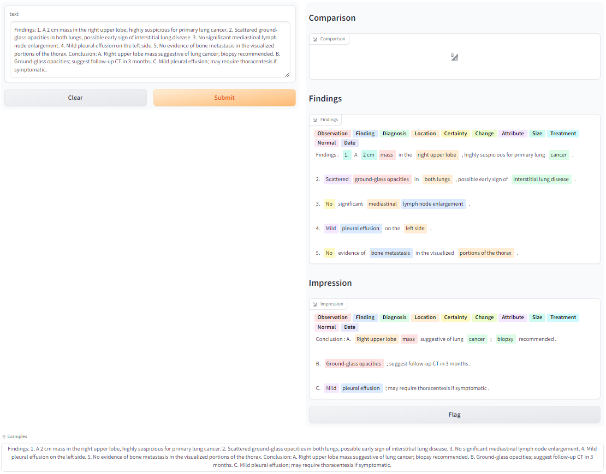

# Chest CT Analytics Server
分析 Chest CT 影像文字報告的資訊，識別發現（Findings）、位置（Location）、診斷（Diagnosis）等實體資訊及它們之間的連接關係。

+ 分析流程：

    臨床發現事件切分（Event Segmentation） → 分詞（Tokenization） → 實體識別（Named Entity Recognition） → 關係萃取（Relationship Extraction）

## 臨床發現事件切分
將影像文字報告切分為數個臨床發現事件的區段及各自的段落資訊，以此為單位進行後續的流程。

影像文字報告：
```
> A 2 cm mass in the right upper lobe, highly suspicious for primary lung cancer. > Scattered ground-glass opacities in both lungs, possible early sign of interstitial lung disease. > No significant mediastinal lymph node enlargement.
```

臨床發現事件：
+ Findings：

    `> A 2 cm mass in the right upper lobe, highly suspicious for primary lung cancer.`

    `> Scattered ground-glass opacities in both lungs, possible early sign of interstitial lung disease.`

    `> No significant mediastinal lymph node enlargement.`

## 分詞
分詞是為了解決報告中出現連字的問題。

連字：
```
> A 2 cm massin the right => > A 2 cm mass in the right ...
```

## 實體識別
總共有 11 種實體，分別是 Observation、Finding、Diagnosis、Location、Certainty、Change、Attribute、Size、Treatment、Normal 和 Date。
+ Observation：影像上所觀察到的異狀。
+ Finding：臨床上的發現。
+ Diagnosis：放射科醫師所判斷的疾病。
+ Location：人體解剖位置資訊。
+ Certainty：否定詞。
+ Change：時間上的狀態變化。
+ Attribute：Observation 或 Finding 的描述資訊。
+ Size：尺寸大小資訊。
+ Treatment：手術治療等資訊。
+ Normal：正常現象的描述。
+ Date：時間資訊。

## 關係萃取
主要以四個實體為出發點，連接其他相關的實體，分別為 Observation、Finding、Treatment 和 Normal。

以下為實體關係圖：






## 伺服器介面
+ 初始畫面：

+ 分析畫面：
